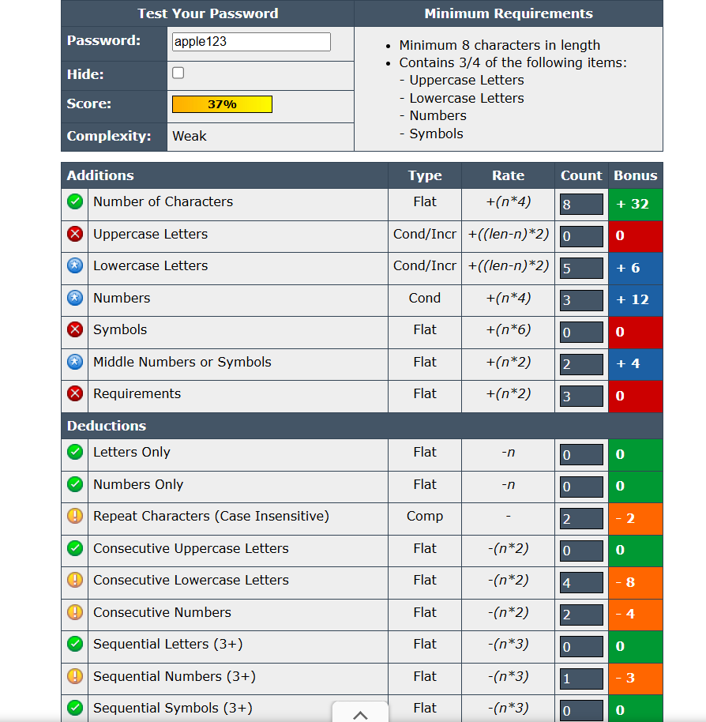
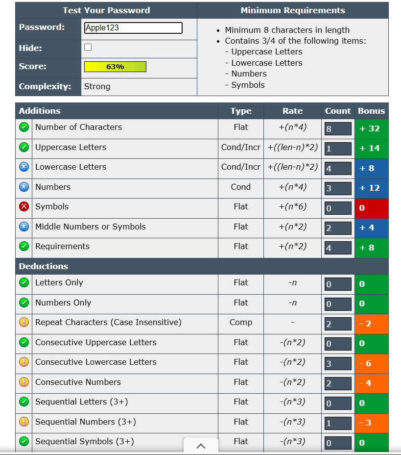
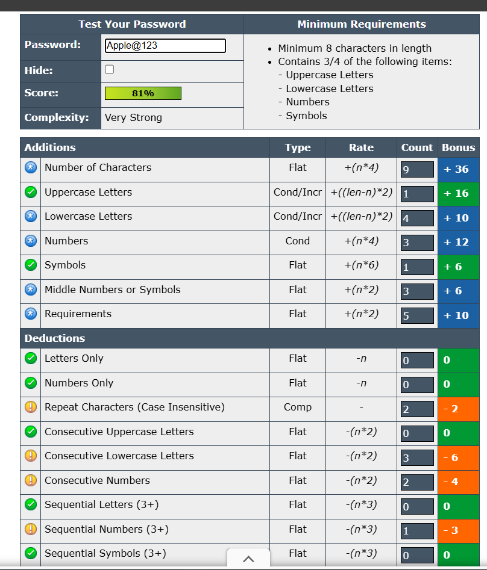
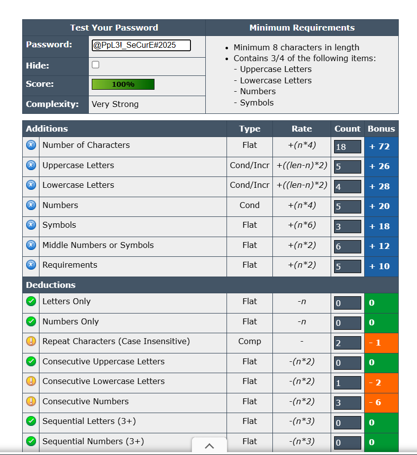

# Task 6 Password Strength Evaluation

### **Objective**

To create passwords of different complexities and evaluate their strength using online password strength tools.

### **Methodology**

Four passwords were created with increasing complexity and tested on [passwordmeter.com](https://passwordmeter.com/). Each password’s strength score and feedback were recorded.

### **Results(with screenshots)**

| Password | Score | Feedback | Strength |
| --- | --- | --- | --- |
| apple123 | 37% | Too simple and predictable | Weak |
| Apple123 | 63% | Add symbols for better strength | Medium |
| Apple@123 | 81% | Good combination | Strong |
| @PpL3!_SeCurE#2025 | 100% | Excellent password strength | Very Strong |

### **Findings**

- Passwords with greater length and variety of character types scored higher.
- Simple or dictionary-based passwords were rated weak and easy to guess.
- Adding special symbols, numbers, and mixed case improves password strength significantly.

### **Best Practices Learned**

1. Minimum 12–16 characters.
2. Use symbols, uppercase, lowercase, and numbers.
3. Avoid dictionary words.
4. Use unique passwords for each site.
5. Consider password managers to store complex passwords.

### **Common Password Attacks**

- **Brute Force:** Systematically guessing all possible combinations.
- **Dictionary:** Using a predefined list of common words.
- **Phishing:** Tricking users into revealing passwords.
- **Credential Stuffing:** Using previously leaked credentials.

### **Conclusion**

Password complexity directly impacts resistance to brute-force and dictionary attacks. Strong passwords with mixed characters and sufficient length offer better security and are harder to crack.